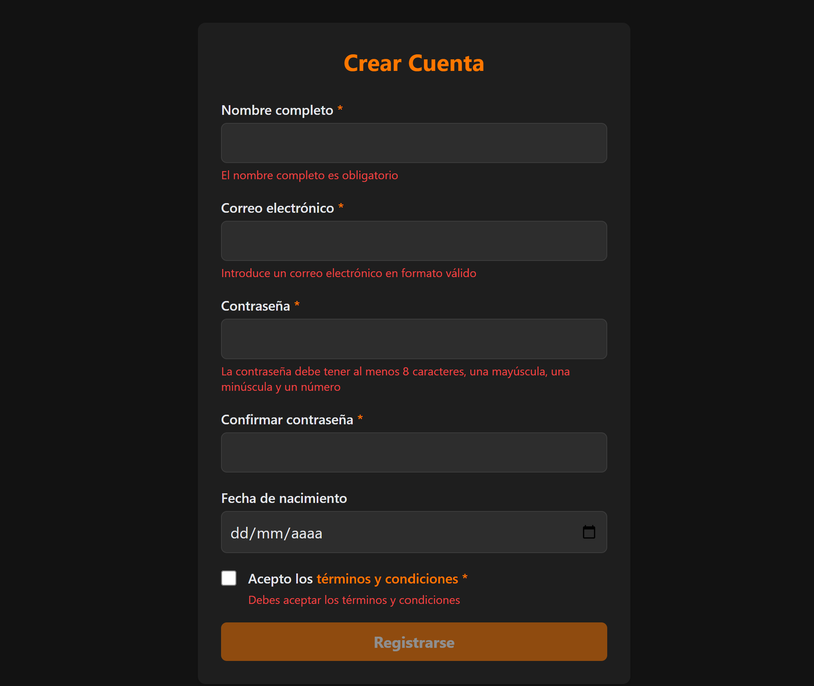
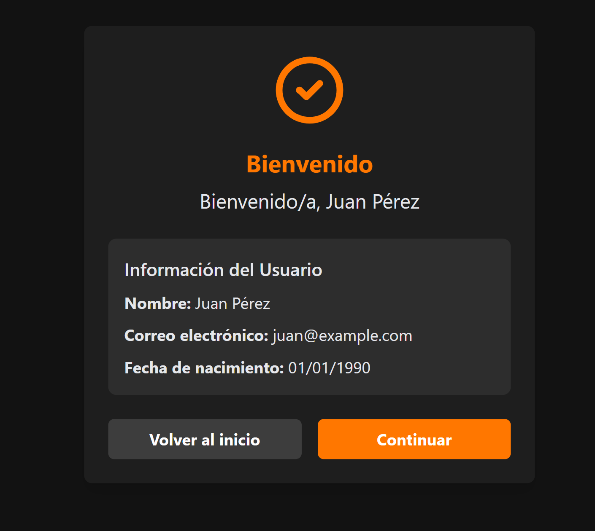
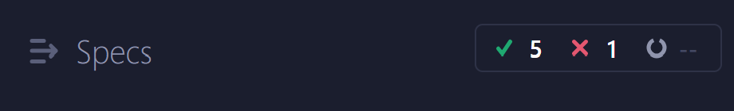
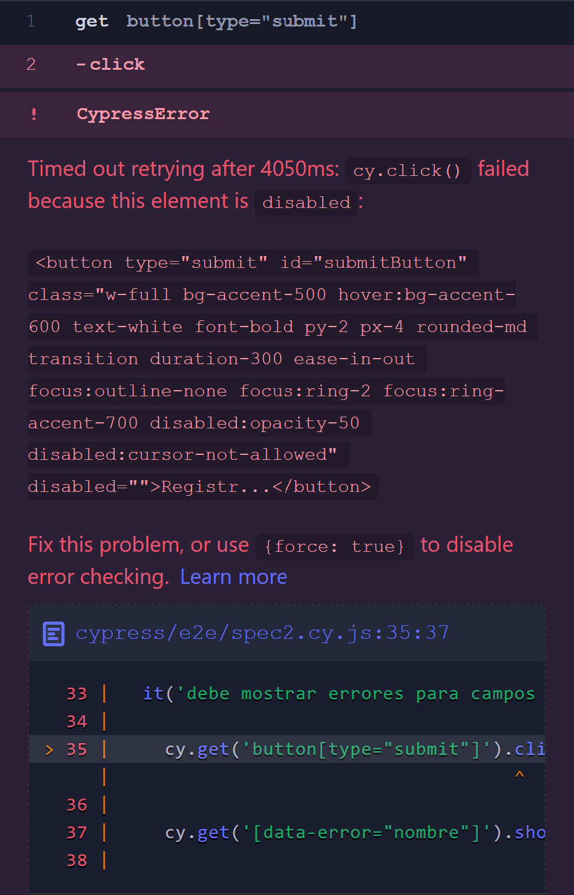
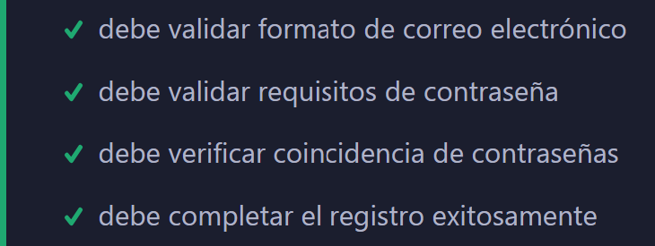

# Link
https://cypresslogintest.netlify.app/

# Formulario de Registro

Este proyecto consiste en un formulario de registro de usuarios con validaciones en tiempo real y una página de confirmación. El formulario está diseñado con una interfaz moderna y oscura utilizando Tailwind CSS.

## Descripción

El sistema de registro incluye:

- Formulario con validación en tiempo real de todos los campos
- Interfaz de usuario con tema oscuro
- Página de confirmación que muestra los datos ingresados
- Pruebas automatizadas con Cypress

## Estructura del Proyecto

```
formulario-registro/
│
├── registro.html         # Página principal con el formulario de registro
├── confirmacion.html     # Página de confirmación tras registro exitoso
├── cypress/
│   ├── integration/
│   │   └── registro.spec.js  # Pruebas de integración con Cypress
│   └── ...
└── README.md             # Este archivo
```

## Características

### Validación de Formulario

El formulario valida en tiempo real:

- **Nombre completo**: Campo obligatorio
- **Correo electrónico**: Formato válido (xxx@xxx.xxx)
- **Contraseña**: Mínimo 8 caracteres, una mayúscula, una minúscula y un número
- **Confirmación de contraseña**: Debe coincidir con la contraseña
- **Términos y condiciones**: Deben ser aceptados

### Interfaz de Usuario

- Diseño responsivo
- Tema oscuro con acentos en naranja
- Mensajes de error específicos para cada campo
- Estado deshabilitado para el botón de envío cuando el formulario no es válido

## Tecnologías Utilizadas

- HTML5
- CSS (Tailwind CSS)
- JavaScript (Vanilla JS)
- Cypress (para pruebas)

## Instalación y Uso

1. Clona este repositorio:
   ```
   git clone https://github.com/usuario/formulario-registro.git
   cd formulario-registro
   ```

2. Abre los archivos HTML en tu navegador o utiliza un servidor local:
   ```
   npx serve
   ```

3. Para ejecutar las pruebas con Cypress:
   ```
   npm install
   npx cypress open
   ```

## Pruebas

Las pruebas con Cypress verifican:

- Carga correcta del formulario
- Mostrar errores para campos obligatorios vacíos
- Validación de formato de correo electrónico
- Validación de requisitos de contraseña
- Verificación de coincidencia de contraseñas
- Habilitación del botón cuando el formulario es válido
- Flujo completo de registro exitoso
- Navegación entre páginas

## Screenshots




**Test Cypress**





## Personalización

Puedes personalizar el formulario modificando los colores en la configuración de Tailwind CSS:

```javascript
tailwind.config = {
    theme: {
        extend: {
            colors: {
                dark: {
                    // Modificar colores del tema oscuro
                },
                accent: {
                    // Modificar colores de acento
                }
            }
        }
    }
}
```

## Contribuciones

Las contribuciones son bienvenidas. Por favor, abre un issue o pull request para sugerencias o mejoras.

## Licencia

[MIT](LICENSE)
